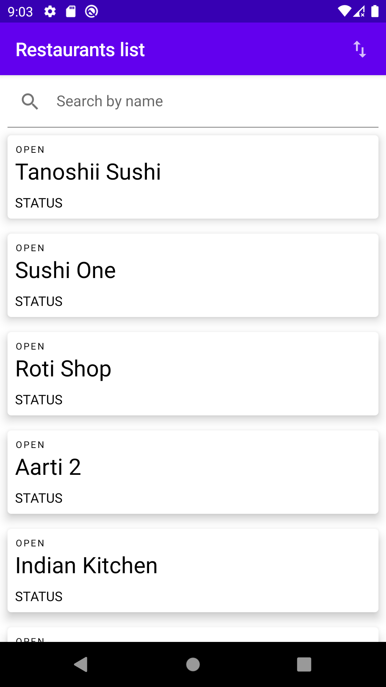

/**
All copy rights back to Zeinab Abdelmawla
**/

Welcome
=======

# LetsEat

## Features
|Load restaurants sorted by default initially.|  </img>  |
|:-----:|:---------:|
|Show restaurants sorted based on STATUS  POPULARITY  BEST_MATCH  NEWEST  RATING  DISTANCE  PRODUCT_PRICE  DELIVERY_FEES  MIN_COST |  </img>  </img> |
|:-----:|:---------:|
|Filter restudies by restaurant name| </img> |

## App Demo

### Contribution process :
- develop code.
- test your code.
- create a pull request.

### Branching model:
- Feature releases will be always tagged and under directory `release` `.
- All contributions bug fix or feature PRs target the `main` branch. to give us the opportunity
  to review and maintain our quality rules.
- Should follow our branch naming convention.
    - `release/release-version`>>`release/1.0.0` : for new feature release.
      Follow [Semantic Versioning] for release updates.
    - `feature/feature-name` : to add a new feature.
    - `fix/bug-description` : to fix a bug.
    - `hotfix/bug-description` : to fix a release bug. note should be taken from the impacted release
      branch.

[Semantic Versioning]: <https://semver.org/>
